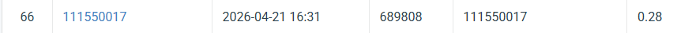

# NYCU Computer Vision 2026 HW2

* **Student ID:** 111550017
* **Name:** 藍逸薰

## Introduction

 The core idea is to build a DETR-based detector with pretrained weight ResNet-50 backbone by emphasizing localization early and focus on classification later.

---

## Environment Setup

How to install dependencies.

```bash
pip install -r requirements.txt
```
---

## Usage

# Training

folder format:  
folder 

&emsp; model.py 

&emsp; test.py  

&emsp; nycu-hw2-data  
&emsp;&emsp; train  
&emsp;&emsp;&emsp; images  
&emsp;&emsp; test  
&emsp;&emsp;&emsp; images  
&emsp;&emsp; val  
&emsp;&emsp;&emsp; images 

&emsp;&emsp; valid.json 

&emsp;&emsp; train.json 


It will train the model. You will have to download best_model.pth from [https://drive.google.com/file/d/1W5Uhz5gB_GPxXubUMzlxlO4LAEdoTtzU/view?usp=sharing](https://drive.google.com/file/d/1rsaeM6yiax2zokw2Rem5_tSxVB6Cdw4X/view?usp=sharing) or e3 first because my Git large file just doesn't seems to be working.

# Training
```bash
python model.py
```
# Testing

```bash
python test.py
```
---

## Performance Snapshot


